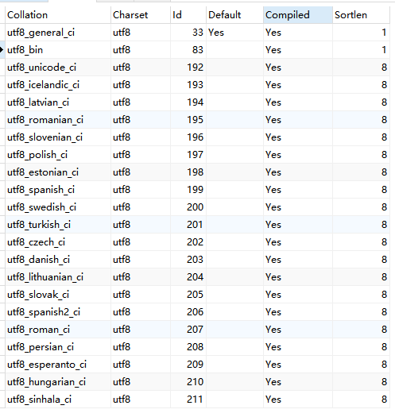

MYSQL的排序规则(COLLATE)

-------------------

1. Character set(字符集)
	- 在新建MySQL的数据库的时候，需要填写character set(字符集)，现在一般都是用`utf8`(一个字符最多占三字节)。还有一种字符集也可以用到是`utf8mb4`(most bytes 4),支持四字节的Unicode编码格式。使用`utf8mb4`可以存储新的字符，比如emoji表情。
	- `utf8`可以转换成`utf8mb4`，不过会有空间上的损失。比如CHAR(n)类型的，因为是固定长度，一个字符要多占一个字节，所以会增加n位的字节，但是还是只能存储n个字符，推荐使用VARCHAR。
2. Collation(排序规则)
	- 通过这个命令查看utf8编码支持的排序规则
	```sql
	SHOW COLLATION WHERE CHARSET='utf8';
	```
	
	可以看到默认的排序规则是`utf8_general_ci`。
	- 排序规则末尾的ci表示case insensitive，忽略大小写。

	```
	mysql> SELECT 'asd' COLLATE utf8_general_ci = 'ASD' COLLATE utf8_general_ci;
	+---------------------------------------------------------------+
	| 'asd' COLLATE utf8_general_ci = 'ASD' COLLATE utf8_general_ci |
	+---------------------------------------------------------------+
	|                                                             1 |
	+---------------------------------------------------------------+
	1 row in set (0.00 sec)
	mysql> SELECT 'asd' COLLATE utf8_bin = 'ASD' COLLATE utf8_bin;
	+-------------------------------------------------+
	| 'asd' COLLATE utf8_bin = 'ASD' COLLATE utf8_bin |
	+-------------------------------------------------+
	|                                               0 |
	+-------------------------------------------------+
	1 row in set (0.00 sec)
	```
	- 如果两个字段的排序规则不一致，会无法比较。
	```
	mysql> SELECT 'asd' COLLATE utf8_bin = 'ASD' COLLATE utf8_general_ci;
	ERROR 1267 (HY000): Illegal mix of collations (utf8_bin,EXPLICIT) and (utf8_general_ci,EXPLICIT) for operation '='
	```
	可以使用`BINARY`运算符转换字段，
	`BINARY str is the shorthand for CAST(str AS BINARY).`
	
	```
mysql> SELECT BINARY('asd' COLLATE utf8_general_ci) = BINARY('ASD' COLLATE utf8_unicode_ci);
+-------------------------------------------------------------------------------+
| BINARY('asd' COLLATE utf8_general_ci) = BINARY('ASD' COLLATE utf8_unicode_ci) |
+-------------------------------------------------------------------------------+
|                                                                             0 |
+-------------------------------------------------------------------------------+
1 row in set (0.00 sec)
	```
	- 可以给不同的字段设置不同的排序规则。
